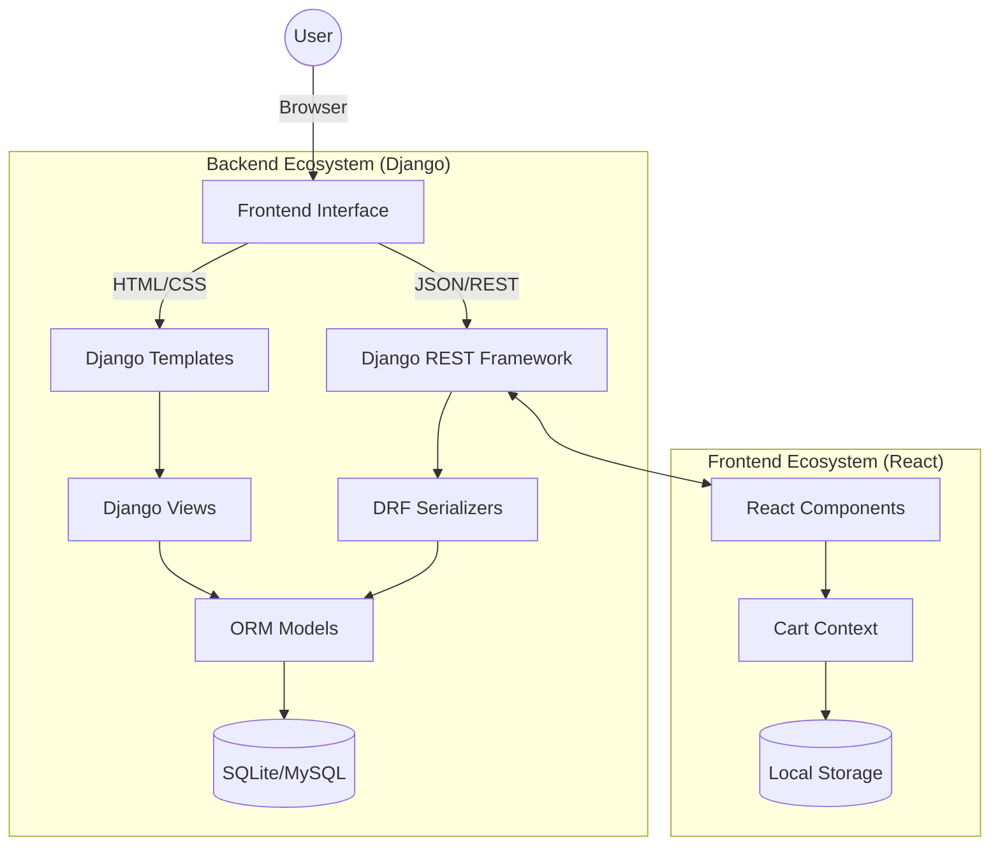
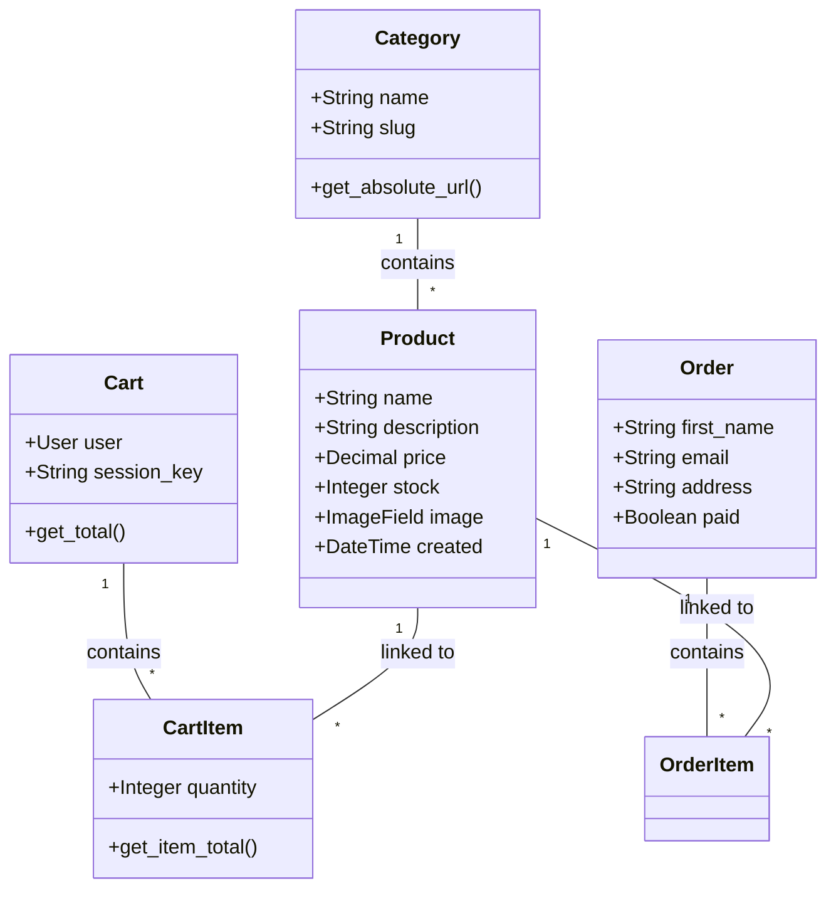

# 🍳 SimpliCulinary Pro: The Ultimate Full-Stack Culinary Experience 🚀

[](https://www.python.org/)
[](https://www.djangoproject.com/)
[](https://reactjs.org/)
[](https://getbootstrap.com/)
[](LICENSE)

Welcome to **SimpliCulinary Pro**, a high-end e-commerce ecosystem designed for culinary professionals. This project represents the evolution from a basic Django application to a sophisticated, full-stack hybrid platform combining **Django Templates** and a **React SPA**.

---

## 🏛️ System Architecture

Our platform uses a hybrid architecture that allows for both traditional server-side rendering and a modern decoupled API approach.



---

## 🛤️ Project Evolution: Step-by-Step Journey

This project was built through a series of intensive workshops, evolving from a simple idea to a production-ready product.

### 📍 Workshop 1-2: The Foundation (Django Core)
*   **Goal**: Setting up the core structure.
*   **Key Tasks**: 
    *   Initializing the Django project and `products` app.
    *   Creating the `Product` and `Category` models.
    *   Building the first views to list products and see details.
    *   Implementing the base layout using Bootstrap.

### 📍 Workshop 3: Advanced Data & Templates
*   **Goal**: Dynamic data management and intelligent templating.
*   **Key Tasks**: 
    *   Customizing the Django Admin for better product management.
    *   Using `django-crispy-forms` for professional looking forms.
    *   Implementing media handling for product images.
    *   Setting up the `base.html` inheritance system.

### 📍 Workshop 4-5: Shopping Cart & State
*   **Goal**: Building a functional e-commerce flow.
*   **Key Tasks**: 
    *   Creating the `cart` app to manage user selections.
    *   Implementing AJAX logic to add products to cart without refreshing.
    *   Developing the checkout flow and order management.
    *   Using context processors to display the cart count everywhere.

### 📍 Workshop 6: The API Era (DRF)
*   **Goal**: Transitioning to a decoupled architecture.
*   **Key Tasks**: 
    *   Installing and configuring `djangorestframework`.
    *   Creating serializers for all models.
    *   Building API endpoints to serve data to external frontends.
    *   Setting up CORS to allow React communication.

### 📍 Final Phase: Professionalization & React Integration 💎
*   **Goal**: Creating a premium, modern experience.
*   **Key Tasks**: 
    *   **Modern Design**: Implementation of a professional blue color scheme and high-end typography.
    *   **React Frontend**: Building a fully responsive Single Page Application with React.
    *   **Image Automation**: Developing a script to dynamically fetch high-quality images via API.
    *   **Localization**: Complete translation of the entire platform into English.

---

## 📊 Database Schema (UML)



---

## 🛠️ Technology Stack

| Component | Technology | Role |
|-----------|------------|------|
| **Backend** |  | Core Logic & API |
| **Frontend** |  | Dynamic SPA |
| **Styling** |  | Responsive Design |
| **Database** |  | Data Persistence |
| **State** |  | Frontend State Management |

---

## ⚡ Quick Start

### 1️⃣ Clone the repository
```bash
git clone https://github.com/Lagmouchyoussef/SimpliCulinary-Pro.git
cd SimpliCulinary-Pro
```

### 2️⃣ Backend Setup (Terminal 1)
```bash
cd backend
python -m venv venv
venv\Scripts\activate
pip install -r requirements.txt
python manage.py migrate
python manage.py runserver 8001
```

### 3️⃣ Frontend Setup (Terminal 2)
```bash
cd frontend
npm install
npm start
```

---

## 📸 Project Showcase

✨ **Premium Home Page**: A stunning hero section with standard professional blue gradients.
✨ **Responsive Product Grid**: Dynamic filtering and interactive cards.
✨ **Modern Cart System**: Real-time updates and secure checkout.

---

Developed with ❤️ by **Lagmouch Youssef**  
⭐ If you find this project useful, please give it a star!
